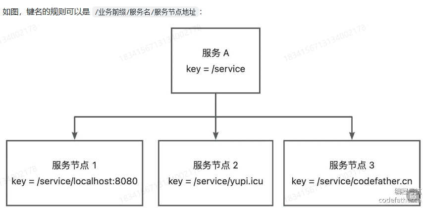

## 注册中心功能

我们先明确注册中心的几个实现关键(核心能力):
1.数据分布式存储:集中的注册信息数据存储、读取和共享

2.服务注册:服务提供者上报服务信息到注册中心

3.服务发现:服务消费者从注册中心拉取服务信息

4.心跳检测:定期检查服务提供者的存活状态

5.服务注销:手动剔除节点、或者自动剔除失效节点

6.更多优化点:比如注册中心本身的容错、服务消费者缓存等等。

## 存储结构设计

1)层级结构。将服务理解为文件夹、将服务对应的多个节点理解为文件夹下的文件,那么可以通过服务名称,用前缀查
询的方式查询到某个服务的所有节点。



2)列表结构。将所有的服务节点以列表的形式整体作为value。


选择哪种存储结构呢?这个也会跟我们的技术选型有关。对于Zookeeper和Etcd这种支持层级查询的中间件,用第一种
结构会更清晰;对于Redis,由于本身就支持列表数据结构,可以选择第二种结构。
最后,一定要给key设置过期时间,比如默认30秒过期,这样如果报务提供者宕机了,也可以超时后自动移除。

## 选型

### etcd

Etcd是一个Go语言实现的、开源的、分布式的键值存储系统,它主要用于分布式系统中的服务发现、配置管理和分布
式锁等场景。
提到Go语言实现,有经验的同学应该就能想到,Etcd的性能是是很高的,而且它和云原生有着密切的关系,通常被作为云
原生应用的基础设施,存储一些元信息。比如经典的容器管理平台k8s就使用了Etcd来存储集群配置信息、状态信息、
节点信息等。

Etcd在其数据模型和组织结构上更接近于ZooKeeper和对象存储,而不是Redis。它使用层次化的键值对来存储数据,支
持类似于文件系统路径的层次结构,能够很灵活地单key查询、按前缀查询、按范围查询。


Etcd的核心数据结构包括:
1.Key(键):Etcd中的基本数据单元,类似于文件系统中的)文件名。每个键都唯一标识一个值,并且可以包含子键,
形成类似于路径的层次结构。

2.Value(值):与键关联的数据,可以是任意类型的数据,通常是字好串形式
只有key、value,是不是比Redis好理解多了?我们可以将数据序列化后写入value

Etcd有很多核心特性,其中,应用较多的特性是:
1. Lease(租约):用于对键值对进行TTL超时设置,即设置键建值对的过期时间。当租约过期时,相关的键值对将被自
   动删除。
2. Watch(监听):可以监视特定键的变化,当键的值发生变化时,会触发相应的通知。 


有了这些特性,我们就能够实现注册中心的服务提供者节点过期和监听了。

此外,Etcd的一大优势就是能够保证数据的强一致性。

Etcd如何保证数据一致性?

从表层来看,Etcd支持事务操作,能够保证数据一致性。
从底层来看,Etcd使用Raft一致性算法来保证数据的一致性。
Raft是一种分布式一致性算法,它确保了分布式系统中的所有节点在任任何时间点都能达成一致的数据视图
具体来说,Raft算法通过选举机制选举出一个领导者(Leader节点,领导者负责接收客户端的写请求,并将写操作复制
到其他节点上。当客户端发送写请求时,领导者首先将写操作写入自己的日志中,并将写操作的日志条目分发给其他节
点,其他节点收到日志后也将其写入自己的日志中。一旦大多数节点(即半数以上的节点)都将该日志条目成功写入到
自己的日志中,该日志条目就被视为已提交,领导者会向客户端发送成功响应。在领导者发送成功响应后,该写操作就被
视为已提交,从而保证了数据的一致性。
如果领导者节点宕机或失去联系,Raft算法会在其他节点中选举出新的领导者,从而保证系统的可用性和一致性。新的
领导者会继续接收客户端的写请求,并负责将写操作复制到其他节点上,从而保持数据的一致性。

### 安装使用

进入Etcd官方的下载页:https://github.com/etcd-io/etcd/releases
也可以在这里下载:https://etcd.io/docs/v3.2/install/

安装完成后,会得到3个脚本:

etcd:etcd服务本身

etcdctl:客户端,用于操作etcd,比如读写数据

etcdutl:备份恢复工具


执行etcd脚本后,可以启动etcd服务,服务默认占用23379和2380端口,作用分别如下:

2379:提供HTTPAPI服务,和etcdctl交互

2380:集群中节点间通讯


### 可视化工具

Etcd可视化工具
一般情况下,我们使用数据存储中间件时,一定要有一个可视化工具能够更直观清晰地管理已经存储的数据。比如Redi
s 的 Redis Desktop Manager。
同样的,Etcd也有一些可视化工具,比如:
etcdkeeper: https://github.com/evildecay/etcdkeeper/

启动
```bash
./etcdkeeper -p 8081
```


### Etcd Java客户端
所谓客户端,就是操作Etcd的工具。
etcd主流的Java客户端是jetcd:https://github.com/etcd-io/jeetcd
注意,Java版本必须大于11!
用法非常简单,就像curator能够操作ZooKeeper、jedis能够操作Reedis-样

引入坐标
```
<!-- https://mvnrepository.com/artifact/io.etcd/jetcd-core -->
<dependency>
    <groupId>io.etcd</groupId>
    <artifactId>jetcd-core</artifactId>
    <version>0.7.7</version>
</dependency>

```

demo
```java
package com.yupi.yurpc.registry;

import io.etcd.jetcd.ByteSequence;
import io.etcd.jetcd.Client;
import io.etcd.jetcd.KV;
import io.etcd.jetcd.kv.GetResponse;

import java.util.concurrent.CompletableFuture;
import java.util.concurrent.ExecutionException;

public class EtcdRegistry {

    public static void main(String[] args) throws ExecutionException, InterruptedException {
        // create client using endpoints
        Client client = Client.builder().endpoints("http://localhost:2379")
                .build();

        KV kvClient = client.getKVClient();
        ByteSequence key = ByteSequence.from("test_key".getBytes());
        ByteSequence value = ByteSequence.from("test_value".getBytes());

        // put the key-value
        kvClient.put(key, value).get();

        // get the CompletableFuture
        CompletableFuture<GetResponse> getFuture = kvClient.get(key);

        // get the value from CompletableFuture
        GetResponse response = getFuture.get();

        // delete the key
        kvClient.delete(key).get();
    }
}

```


1.kvClient:用于对etcd中的键值对进行操作。通过kvClient可以进行设置值、获取值、删除值、列出目录等操作。 

2.leaseClient:用于管理etcd的租约机制。租约是etcd中的一种时间片,用于为键值对分配生存时间,并在租约到期
时自动删除相关的键值对。通过leaseClient可以创建、获取、续约和撤销租约。

3.watchClient:用于监视etcd中键的变化,并在键的值发生变化时挂装收通知。

4.clusterClient:用于与etcd集群进行交互,包括添加、移除、列出成员、设置选举、获取集群的健康状态、获取成员
列表信息等操作。

5.authClient:用于管理etcd的身份验证和授权。通过authClient可以添加、删除、列出用户、角色等身份信息,以及
授予或撤销用户或角色的权限。

6.maintenanceClient:用于执行etcd的维护操作,如健康检查、数据库备份、成员维护、数据库快照、数据库压缩
等。

7.lockClient:用于实现分布式锁功能,通过lockClient可以在etcd上创建、获取、释放锁,能够轻松实现并发控制。

8.electionClient:用于实现分布式选举功能,可以在etcd上创建选举、提交选票、监视选举结果等。

绝大多数情况下,用前3个客户端就足够了。