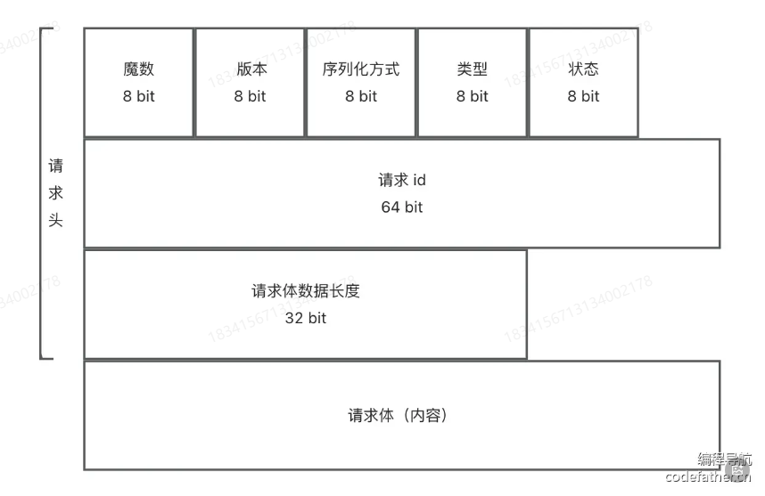

HTTP协议是当前RPC框架传输的一种实现

我们也可以自定义RPC协议

## 设计

rpc协议分为两部分

1、网络传输

2、消息结构

### 网络传输

HTTP协议头部信息较大，且HTTP协议是无状态的，就是每次的HTTP请求都是独立的，每次请求都要重新建立和关闭连接。

HTTP本身是应用层协议，那我们RPC也是应用层的，我们可以选择基于更底层负责传输的TCP协议来实现。

### 消息结构设计

自定义消息结构想要节省空间，就要选用更小的数据结构，比如byte字节类型

消息体的组成

魔数:作用是安全校验,防止服务器处理了非框架发来的乱七八糟的消息(类似HTTPS的安全证书)

版本号:保证请求和响应的一致性(类似HTTP协议有1.0/2.0等版本(2)

序列化方式:来告诉服务端和客户端如何解析数据(类似HTTP的CContent-Type内容类型)

类型:标识是请求还是响应?或者是心跳检测等其他用途。(类似HTTP有请求头和响应头)

状态:如果是响应,记录响应的结果(类似HTTP的200状态代码)

另外由于TCP协议本身存在粘包和拆包的问题，我们还要在头部标记数据长度

实际上,这些数据应该是紧凑的,请求头信息总长17个字节。也就是说,上述消息结构,本质上就是拼接在一起的一个
字节数组。我们后续实现时,需要有消息编码器和消息解码器,编码器先new一个空的Buffer缓冲区,然后按照顺序
向缓冲区依次写入这些数据;解码器在读取时也按照顺序依次读取,就能还原出编码前的数据。

## 使用vertx

### vertx服务端和客户端

com/dong/dongrpc/server/tcp/VertxTcpClient.java
com/dong/dongrpc/server/tcp/VertxTcpServer.java

可以通过测试来看两者的交互

## 编码器和解码器

在代码中，我们看到客户端和服务端通信都是需要将数据先转成buffer来处理

因此需要自定义编码器解码器来实现将java对象转成buffer类型

