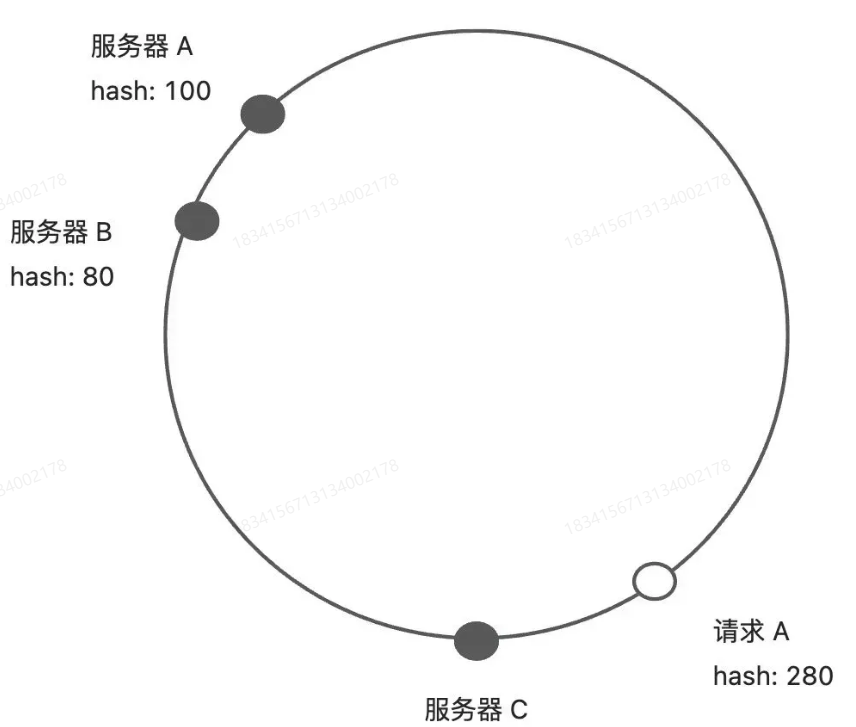
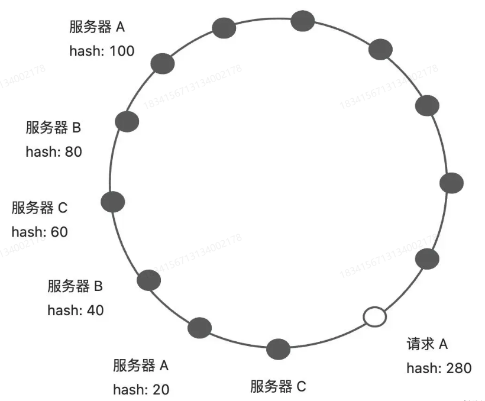

## 基础

负责：就是要处理的工作
均衡：就是将工作合理地分配给工作者

## 策略

### 轮询

按顺序一个一个来

### 随机

随机无序一个一个来

### 加权轮询

性能强的执行次数更多，但依然是有顺序的

比如：1,1,1,2 1,1,1,3

### 加权随机

和上面相似，但是无序

### 最小连接

当前连接数最小的优先处理

### IP hash

根据客户端IP进行Hash，同IP的请求会请求到同一个服务器

### 一致性HASH

用于将请求均匀地分配到多个节点上

思想是将hash值空间划成一个环状结构，每个节点在环上占据一个位置，请求也会落在还上的某个位置

请求落地后，会沿着环进行寻找，找到第一个服务器节点，将请求交于对应的服务器处理

**解决的问题**

节点下线：如果一个节点下线了，环上服务器节点位置不变，那么只有其中一个节点处理的请求会变多，其他节点的状态是不受影响

节点倾斜：如果环上节点比较少，两个服务器节点本身挨得比较近，那么势必会造成请求不均匀，这样就可以引入虚拟节点，让两个服务器节点均匀进行分布

如下面两个图
引入虚拟节点前：

引入虚拟节点后：
